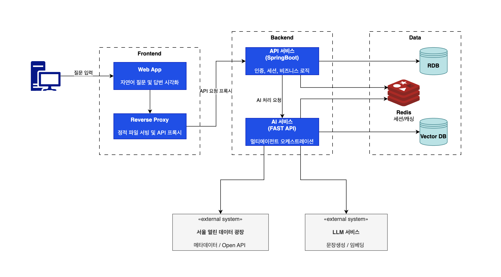

## Overview



---
## AI Service (FastAPI)
> 멀티에이전트 오케스트레이션과 LLM 기반 추론을 담당한다. 자연어 답변에 포함될 데이터 조회(SQL, 벡터, 지도)는 에이전트가 호출하는 tool로 구축한다.

``` 
ai-service/
├── routers/
│   └── chat.py                    # POST /chat/stream — SSE 스트리밍 진입점
├── agents/
│   ├── graph.py                   # LangGraph 워크플로우 조립 (Phase 2)
│   ├── router_agent.py            # 사용자 의도 분류 (SQL_SEARCH / VECTOR_SEARCH / MAP / FALLBACK)
│   ├── sql_agent.py               # sql_search tool 호출 → 정형 데이터 조회
│   ├── vector_agent.py            # 질의 정제 → vector_search tool 호출 → 유사도 검색
│   └── answer_agent.py            # 조회 결과 → 자연어 답변 + 시설 카드 가공, URL 미존재 시 fallback 링크 처리
├── tools/
│   ├── sql_search.py              # PostgreSQL 정형 조회 (카테고리, 상태, 지역, 날짜 필터)
│   ├── vector_search.py           # pgvector 임베딩 유사도 검색
│   └── map_search.py              # earthdistance + cube 반경 검색, GeoJSON 반환
├── llm/
│   ├── client.py                  # LLM API 호출 추상화 (Gemini / GPT)
│   └── embedder.py                # 텍스트 → 벡터 변환 (임베딩 모델 호출)
├── schemas/
│   ├── state.py                   # AgentState — LangGraph 공유 상태 정의
│   ├── events.py                  # SSE 이벤트 타입 (agent_start, tool_call, token, done 등)
│   └── chat.py                    # ChatRequest / ChatResponse
├── core/
│   ├── config.py                  # 환경변수, DB 접속 정보, LLM API 키
│   └── database.py                # async SQLAlchemy 세션 (PostgreSQL 접속)
├── scripts/
│   └── embed_metadata.py          # 시설 메타데이터 → 임베딩 → pgvector 적재 (배치)
└── middleware/
    └── metrics.py                 # 응답시간 측정
```

### 주요 설계 사항
**pgvector 단일 인스턴스**: 별도 벡터DB(Qdrant) 대신 PostgreSQL pgvector 확장을 사용한다. 1000건 미만의 데이터에서 별도 인프라를 운영할 이유가 없고, SQL 조회와 벡터 검색이 동일 DB에서 가능하므로 복합 질의(벡터 → SQL 필터 조합)가 단순해진다.

**tool 3종 분리**: `sql_search`, `vector_search`, `map_search`는 각각 입력 파라미터와 반환 형태가 다르므로 별도 tool로 분리한다. Router Agent가 의도에 따라 적절한 tool을 선택하고, 결과는 Answer Agent에서 통합 가공한다.

**fallback_link를 별도 tool에서 제거**: URL 미존재 시 서울시 공공예약 메인 링크로 대체하는 로직은 Answer Agent 내부에서 조건 분기로 처리한다. 별도 tool로 분리할 만큼 복잡하지 않다.

---

## API Service (Spring Boot)
>인증, 세션, 데이터 수집, 변경 이력 관리, 알림 발송, 대화 이력을 담당한다.

Gradle 멀티모듈 구성: `app`(Spring Boot 진입점) → `domain`(공유 엔티티) ← `collector`(수집 파이프라인), 그리고 모든 모듈이 의존하는 `common`(공통 유틸·전역 예외).

```
on-seoul-api/                                    # 루트 (공통 빌드 설정, 소스 없음)
│
├── common/                                      # 공통 모듈 (프레임워크 의존 최소)
│   └── exception/
│       ├── ErrorCode.java                       # 전역 에러 코드
│       └── OnSeoulApiException.java             # 전역 기반 예외
│
├── domain/                                      # 공용 도메인 모듈 (JPA 엔티티 · Repository)
│   └── domain/
│       ├── User.java                            # 사용자 엔티티
│       ├── ChatHistory.java                     # 대화 이력 엔티티 (질문 + 응답)
│       ├── PublicServiceReservation.java        # 공공서비스 예약 엔티티 (current 테이블)
│       └── NotificationSubscription.java        # 알림 구독 설정 엔티티 (카테고리, 자치구, 키워드)
│   └── repository/
│       └── PublicServiceReservationRepository.java
│
├── collector/                                   # 수집 모듈 (파이프라인 + 운영 엔티티)
│   └── domain/                                  # 수집 파이프라인 전용 엔티티
│       ├── CollectionHistory.java               # 수집 실행 이력
│       ├── ServiceChangeLog.java                # 서비스 변경 이력 (NEW / UPDATED / DELETED)
│       └── DataSourceCatalog.java               # 수집 대상 API 카탈로그
│   └── repository/
│   └── enums/                                   # CollectionStatus, ChangeType
│   └── service/
│       ├── CollectionService.java               # Open API 수집 파이프라인 (전체 갱신 + diff 감지)
│       └── ChangeLogService.java                # 서비스 변경 이력 기록 (NEW / UPDATED / DELETED)
│   └── client/
│       └── SeoulOpenApiClient.java              # 서울시 Open API 호출 (WebClient, 페이지네이션)
│
├── app/                                         # 앱 모듈 (Spring Boot 진입점)
│   └── controller/
│       ├── AuthController.java                  # 로그인 / 로그아웃 / 회원가입
│       ├── ChatController.java                  # POST /api/chat — AI 서비스 SSE 릴레이
│       ├── HistoryController.java               # 대화 이력 조회
│       └── NotificationController.java          # 알림 구독 설정 조회/수정
│   └── service/
│       ├── AuthService.java                     # 인증 비즈니스 로직
│       ├── ChatService.java                     # AI 서비스 SSE 스트림 수신 + 프론트엔드 릴레이 + 이력 저장
│       ├── HistoryService.java                  # 대화 이력 조회
│       └── NotificationService.java             # 상태 변경 감지 → 고정 템플릿 알림 발송 (FCM)
│   └── client/
│       └── AiServiceClient.java                 # FastAPI SSE 스트림 수신 (WebClient)
│   └── scheduler/
│       └── CollectionScheduler.java             # 일 1회 수집 트리거 → CollectionService → ChangeLogService → NotificationService
│   └── security/
│       ├── SecurityConfig.java                  # Spring Security 설정 (세션 기반)
│       ├── CustomUserDetailsService.java
│       └── SessionAuthFilter.java               # 요청마다 세션 검증
│
└── migration-scripts/                           # DB 마이그레이션 SQL
```

### 주요 설계 사항
**데이터 수집 흐름**: `CollectionScheduler`가 트리거되면 `CollectionService`(전체 갱신 + staging 비교) → `ChangeLogService`(변경분 이벤트 로그 기록) → `NotificationService`(구독 조건 매칭 → FCM 발송) 순서로 동기 호출한다. 세 단계가 하나의 스케줄러 실행 사이클에서 완결되므로 별도 메시지 큐 없이 처리한다.

**ChatController의 SSE 릴레이 역할**: 프론트엔드의 SSE 요청을 받아 AI 서비스에 전달하고, AI 서비스의 스트리밍 응답을 `SseEmitter`로 그대로 릴레이한다. 스트림 완료 후 질문과 최종 응답을 `ChatHistory`에 저장한다.

**QueryController → ChatController 변경**: SSE 스트리밍 기반으로 통신 방식이 결정되었으므로, 단순 질의-응답이 아닌 채팅 스트리밍 맥락을 반영하여 네이밍을 변경했다.