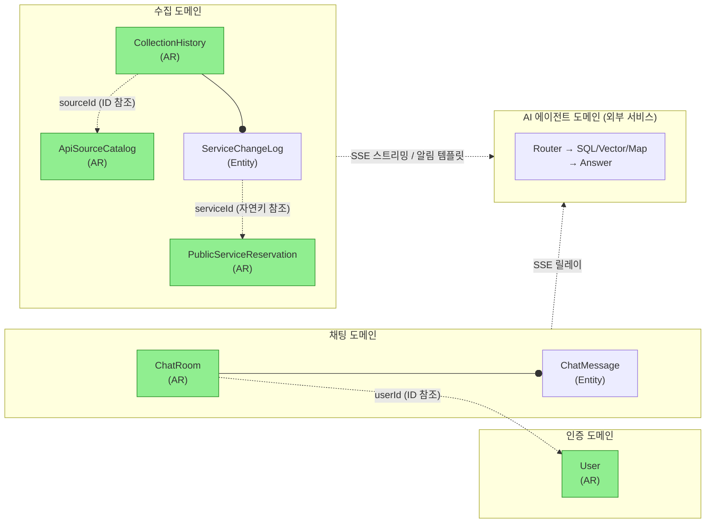
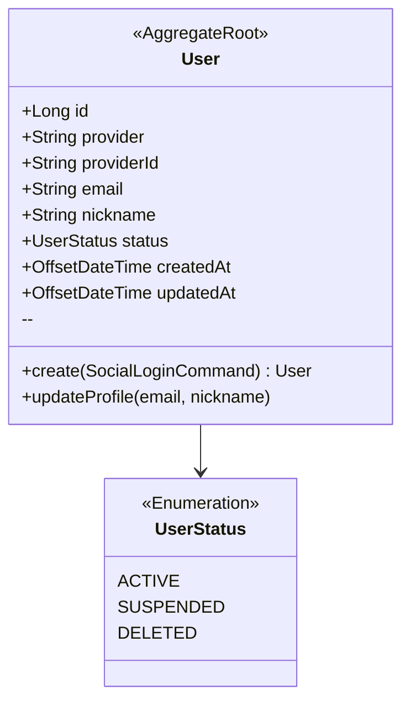
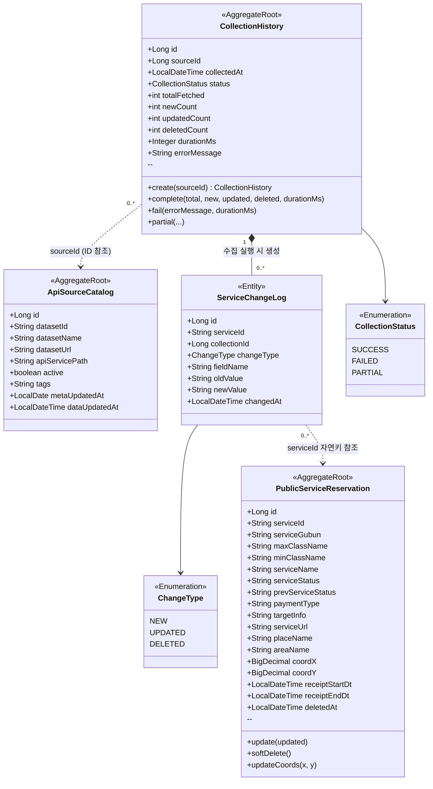
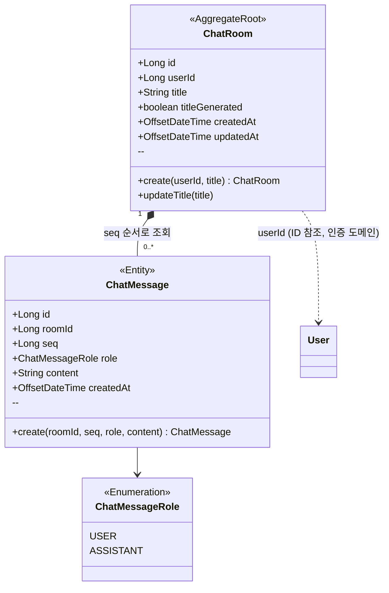
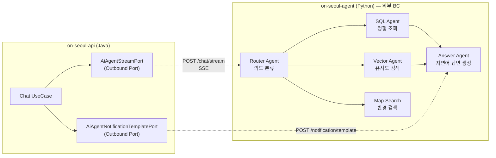
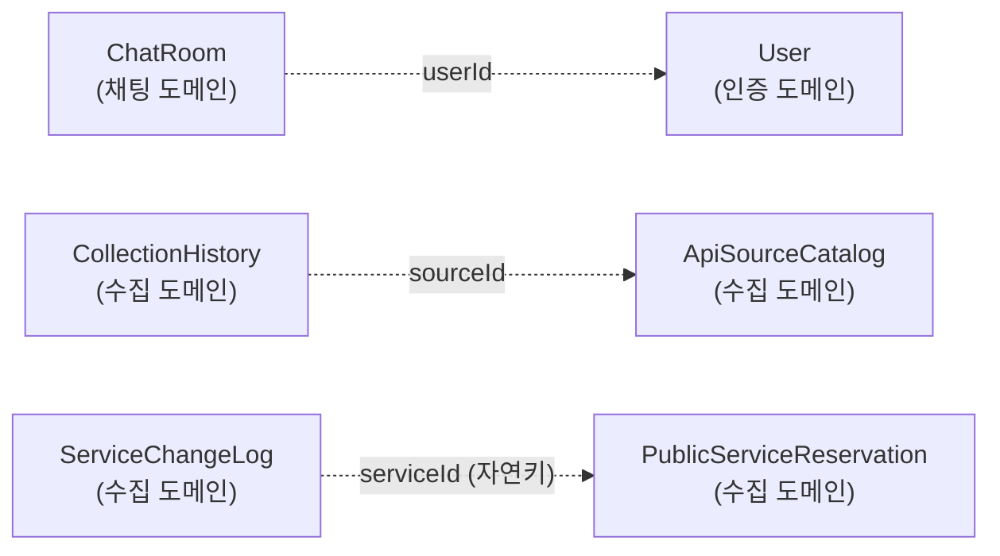

# 도메인 모델 / 애그리거트 다이어그램

> **대상:** on-seoul 전체 (API Service + AI Service)
> **작성일:** 2026-04-25

---

## 1. 바운디드 컨텍스트 개요

on-seoul은 네 개의 바운디드 컨텍스트로 구성된다.

| 컨텍스트 | 서비스 | 핵심 모델 |
|---|---|---|
| 인증 (Auth) | on-seoul-api | User |
| 수집 (Collection) | on-seoul-api | ApiSourceCatalog, PublicServiceReservation, CollectionHistory |
| 채팅 (Chat) | on-seoul-api | ChatRoom, ChatMessage |
| AI 에이전트 (AI Agent) | on-seoul-agent (외부) | AgentState, SearchResult |

> **AR** = Aggregate Root (애그리거트 루트). 초록색으로 표시.
> 점선 = 바운더리를 넘는 ID 참조 (객체 참조 금지, ID만 보관).

---

## 2. 인증 도메인 (Auth)

소셜 로그인(OAuth2)으로 가입/로그인한 사용자를 관리한다. `User`가 유일한 애그리거트 루트이며, 채팅 도메인에서 `userId`로 참조된다.

**불변 조건:**
- `provider` + `providerId` 조합은 전역 유일 (복합 자연키).
- `status = SUSPENDED` 또는 `DELETED`이면 토큰 발급 및 갱신 거부.

---

## 3. 수집 도메인 (Collection)

서울 열린데이터 광장 Open API에서 공공서비스 예약 데이터를 수집·정제한다.
세 개의 애그리거트로 구성되며, 각각 독립적인 생명주기를 가진다.

**애그리거트별 역할:**

| 애그리거트 | 생명주기 | 불변 조건 |
|---|---|---|
| `ApiSourceCatalog` | 운영자 설정 시 생성, `active=false`로 비활성화 | `datasetId` 전역 유일 |
| `CollectionHistory` | 수집 실행마다 1개 생성, 종료 시 한 번만 결과 기록 | `durationMs != null`이면 결과 재기록 불가 |
| `PublicServiceReservation` | 최초 수집 시 INSERT, 이후 upsert. soft delete | `serviceId`(서울 API 자연키) 전역 유일 |
| `ServiceChangeLog` (CollectionHistory 내부) | CollectionHistory와 동일한 트랜잭션에서 생성 | 생성 후 불변 (audit log) |

---

## 4. 채팅 도메인 (Chat)

사용자와 AI 에이전트 간의 대화 세션과 메시지 이력을 관리한다. `ChatRoom`이 애그리거트 루트이며 `ChatMessage`의 생명주기를 통제한다.

**불변 조건:**
- `ChatMessage.seq`는 동일 Room 내에서 단조 증가 (메시지 순서 보장).
- `ChatRoom`은 특정 `userId`에 귀속되며, 다른 사용자의 Room에 메시지 추가 불가.
- `title`은 AI가 자동 생성하거나 사용자가 직접 수정할 수 있다 (`titleGenerated` 플래그로 구분).

---

## 5. AI 에이전트 도메인 (외부 바운디드 컨텍스트)

`on-seoul-agent` (Python FastAPI)가 담당하는 별도 서비스다. API Service(`on-seoul-api`)와는 포트 인터페이스로만 통신하며, Java 도메인 모델을 공유하지 않는다.

**인터페이스 계약:**

| 포트 | 방향 | 프로토콜 | 비고 |
|---|---|---|---|
| `AiAgentStreamPort` | API → AI | HTTP SSE (astream_events) | 질문 → 토큰 스트림 |
| `AiAgentNotificationTemplatePort` | API → AI | HTTP POST/Response | 변경 이벤트 → 알림 메시지 생성 |

---

## 6. 크로스 도메인 참조 요약

| 참조하는 쪽 | 참조 대상 | 방식 | 이유 |
|---|---|---|---|
| `ChatRoom.userId` | `User` | ID 참조 | 채팅 ↔ 인증 도메인 경계 분리 |
| `CollectionHistory.sourceId` | `ApiSourceCatalog` | ID 참조 | 수집 이력이 소스 설정에 느슨하게 의존 |
| `ServiceChangeLog.serviceId` | `PublicServiceReservation` | 자연키(String) | 서울 API의 고유 ID. 도메인 객체 없이 참조 가능 |

> **원칙:** 바운디드 컨텍스트 경계를 넘는 참조는 반드시 ID(또는 자연키)로만 한다. 객체 그래프를 경계 밖으로 노출하지 않는다.
