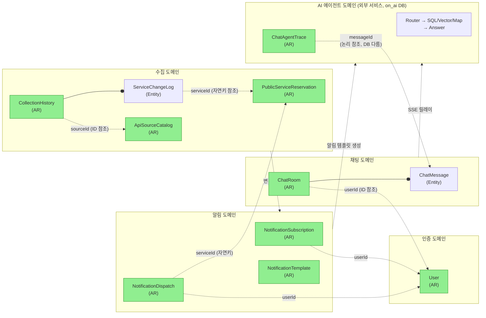
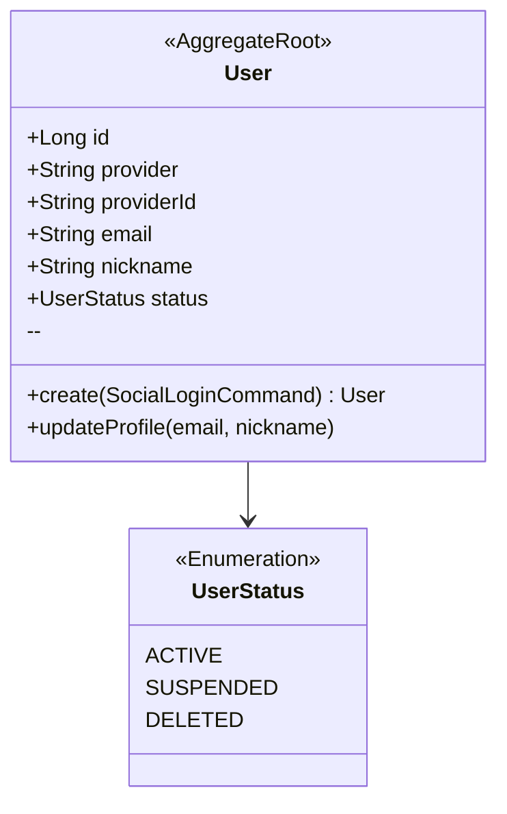
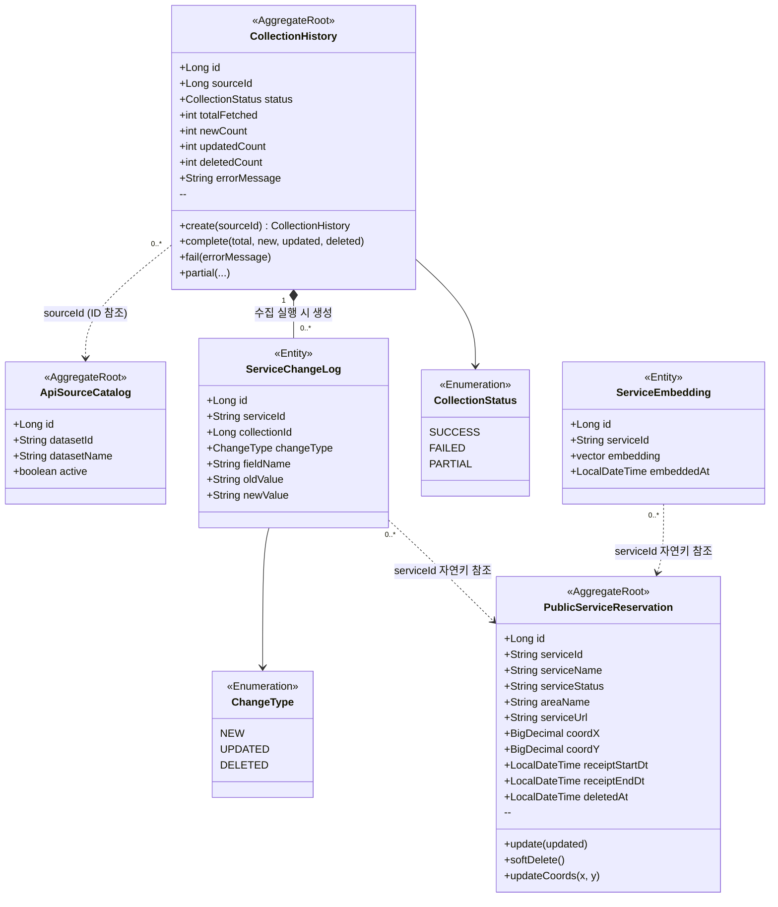
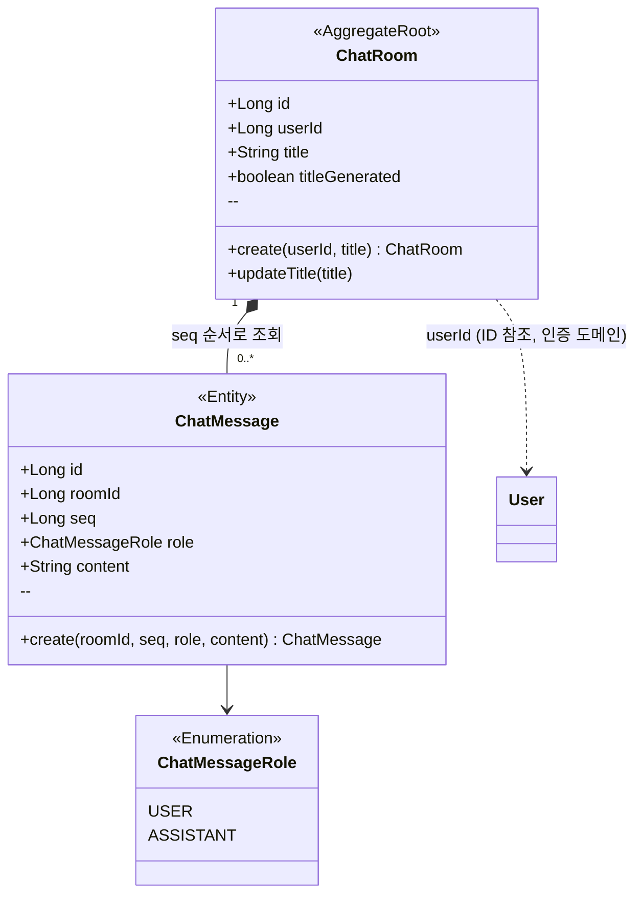
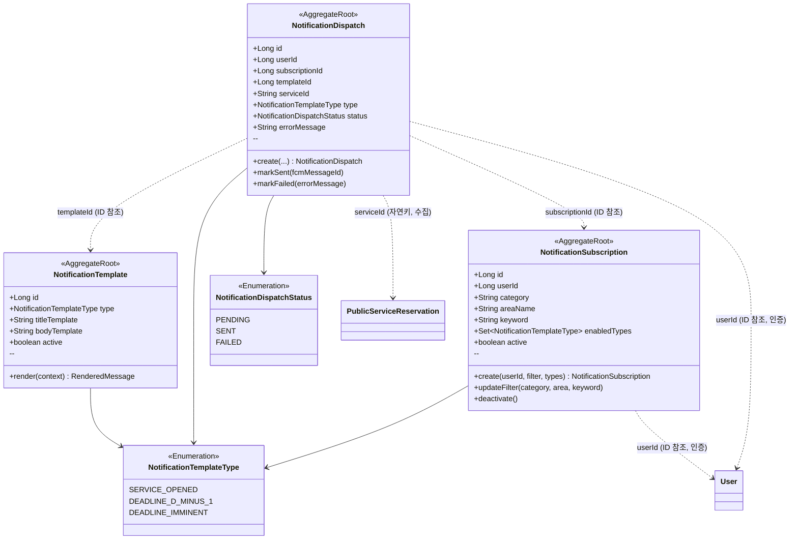
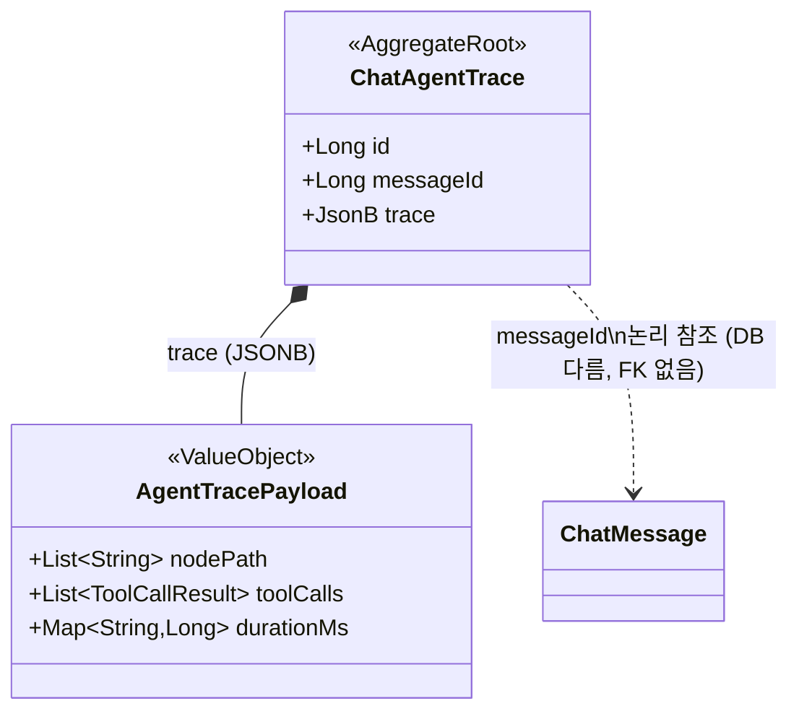
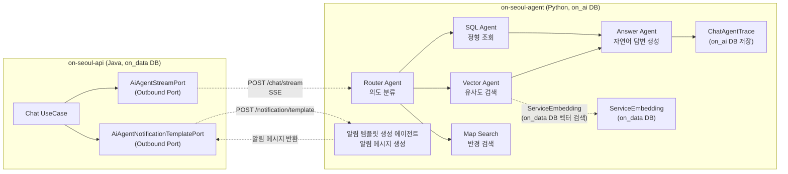
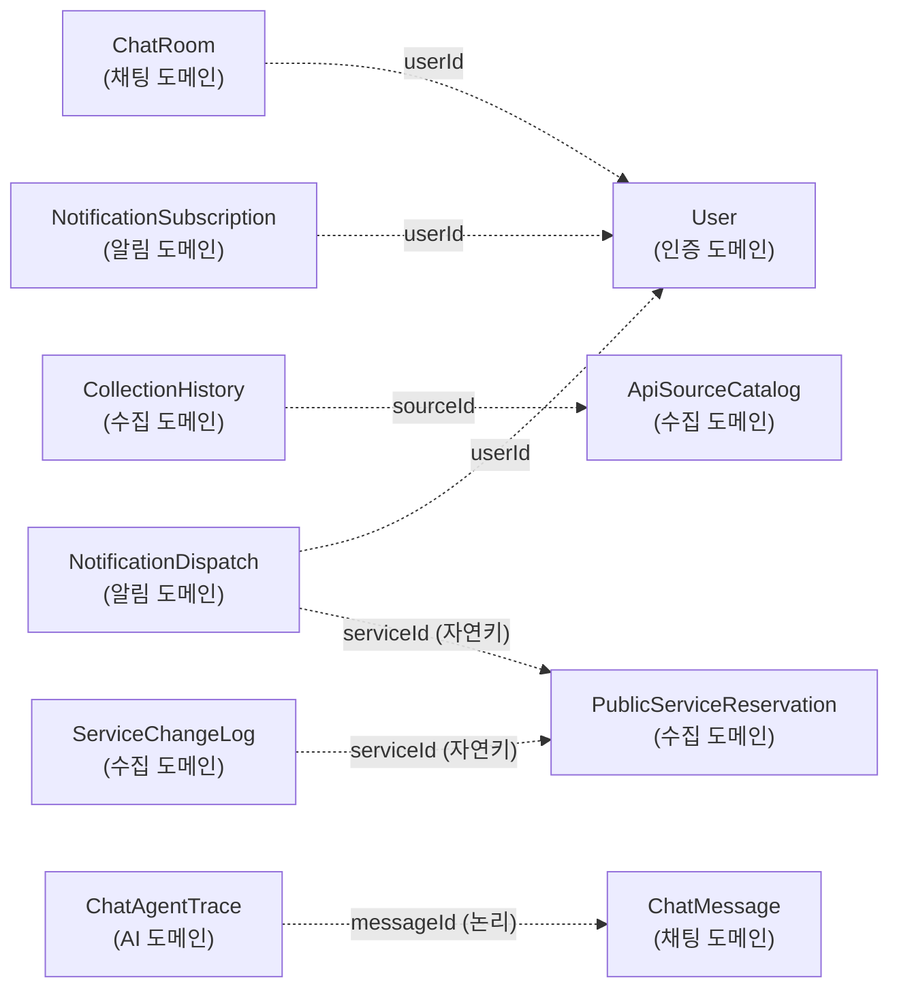

# 도메인 모델 / 애그리거트 다이어그램

> **대상:** on-seoul 전체 (API Service + AI Service)
> **작성일:** 2026-04-25

---

## 1. 바운디드 컨텍스트 개요

on-seoul은 다섯 개의 바운디드 컨텍스트로 구성된다.

| 컨텍스트 | 서비스 | 핵심 모델 |
|---|---|---|
| 인증 (Auth) | on-seoul-api | User |
| 수집 (Collection) | on-seoul-api | ApiSourceCatalog, PublicServiceReservation, CollectionHistory |
| 채팅 (Chat) | on-seoul-api | ChatRoom, ChatMessage |
| 알림 (Notification) | on-seoul-api | NotificationSubscription, NotificationTemplate, NotificationDispatch |
| AI 에이전트 (AI Agent) | on-seoul-agent (외부, on_ai DB) | AgentState, SearchResult, ChatAgentTrace |



> **AR** = Aggregate Root (애그리거트 루트). 초록색으로 표시.
> 점선 = 바운더리를 넘는 ID 참조 (객체 참조 금지, ID만 보관).

---

## 2. 인증 도메인 (Auth)

소셜 로그인(OAuth2)으로 가입/로그인한 사용자를 관리한다. `User`가 유일한 애그리거트 루트이며, 채팅 도메인에서 `userId`로 참조된다.



**불변 조건:**
- `provider` + `providerId` 조합은 전역 유일 (복합 자연키).
- `status = SUSPENDED` 또는 `DELETED`이면 토큰 발급 및 갱신 거부.

---

## 3. 수집 도메인 (Collection)

서울 열린데이터 광장 Open API에서 공공서비스 예약 데이터를 수집·정제한다.
세 개의 애그리거트로 구성되며, 각각 독립적인 생명주기를 가진다.



**애그리거트별 역할:**

| 애그리거트 | 생명주기 | 불변 조건 |
|---|---|---|
| `ApiSourceCatalog` | 운영자 설정 시 생성, `active=false`로 비활성화 | `datasetId` 전역 유일 |
| `CollectionHistory` | 수집 실행마다 1개 생성, 종료 시 한 번만 결과 기록 | `durationMs != null`이면 결과 재기록 불가 |
| `PublicServiceReservation` | 최초 수집 시 INSERT, 이후 upsert. soft delete | `serviceId`(서울 API 자연키) 전역 유일 |
| `ServiceChangeLog` (CollectionHistory 내부) | CollectionHistory와 동일한 트랜잭션에서 생성 | 생성 후 불변 (audit log) |
| `ServiceEmbedding` | 수집 후 임베딩 스크립트로 생성/갱신 | `serviceId` 당 임베딩 1건. AI Agent 벡터 검색에서 참조 |

---

## 4. 채팅 도메인 (Chat)

사용자와 AI 에이전트 간의 대화 세션과 메시지 이력을 관리한다. `ChatRoom`이 애그리거트 루트이며 `ChatMessage`의 생명주기를 통제한다.



**불변 조건:**
- `ChatMessage.seq`는 동일 Room 내에서 단조 증가 (메시지 순서 보장).
- `ChatRoom`은 특정 `userId`에 귀속되며, 다른 사용자의 Room에 메시지 추가 불가.
- `title`은 AI가 자동 생성하거나 사용자가 직접 수정할 수 있다 (`titleGenerated` 플래그로 구분).

---

## 5. 알림 도메인 (Notification)

서비스 상태 변경(개시·마감 임박 등)을 감지하여 사용자에게 푸시 알림을 발송한다. 메시지 *생성*은 AI Service(`POST /notification/template`)가 담당하고, *발송*은 API Service(FCM)가 담당한다. 네 개의 애그리거트로 구성되며 각각 독립 생명주기를 가진다.



**애그리거트별 역할:**

| 애그리거트 | 생명주기 | 불변 조건 |
|---|---|---|
| `NotificationSubscription` | 사용자가 구독 등록 시 생성, 비활성화 가능 | (userId, category, areaName, keyword) 조합 유일 |
| `NotificationTemplate` | 운영자 정의. `type`별 1건 활성 | `type` 당 `active=true` 한 건만 유효 |
| `NotificationDispatch` | 발송 시도마다 1개 생성 (audit log) | 생성 후 `status` 외 변경 불가. SENT/FAILED는 종착 상태 |

**메시지 생성 흐름:**

```
수집 도메인 변경 감지 (서비스 개시 / D-1 / 마감 임박)
  → NotificationSubscription 매칭 (필터: 카테고리·자치구·키워드)
  → AI Service (POST /notification/template) — 알림 템플릿 생성 에이전트가 자연어 메시지 생성
  → NotificationTemplate.render() — 정형 변수 치환 (fallback)
  → 브라우저 웹 푸시 발송 (단일 클라이언트)
  → NotificationDispatch 기록
```

> **AI Service의 역할:** 단순 템플릿 치환을 넘어 시설 정보·예약 URL 등을 조합한 자연어 메시지를 생성한다. AI 호출 실패 시 `NotificationTemplate.render()` 결과로 폴백한다.

---

## 6. AI 에이전트 도메인 (외부 바운디드 컨텍스트)

`on-seoul-agent` (Python FastAPI)가 담당하는 별도 서비스다. 전용 DB(`on_ai`)를 가지며, API Service(`on-seoul-api`)와는 포트 인터페이스로만 통신한다.

### ChatAgentTrace 애그리거트

LangGraph 에이전트 실행 메타데이터를 저장한다. `ASSISTANT` 역할의 메시지에만 생성된다.



**설계 결정:**

| 항목 | 내용 |
|---|---|
| DB | `on_ai` (on-seoul-agent 전용). `on_data`의 `chat_messages`와 물리 FK 불가 |
| `messageId` 참조 | 논리 참조(자연키). DB가 달라 JOIN 불가, 조회는 API Service가 message_id로 직접 요청 |
| `trace` 컬럼 | JSONB. node 경로·tool call 결과·소요 시간 등 실행 메타. 스키마 유연성이 필요해 JSONB 선택 |
| 생성 조건 | `ChatMessageRole = ASSISTANT`인 메시지에만 생성 (사용자 발화에는 생성 안 함) |
| 불변성 | 생성 후 수정 없음 (실행 결과 audit log) |

### 서비스 경계 및 포트 인터페이스



**인터페이스 계약:**

| 포트 | 방향 | 프로토콜 | 비고 |
|---|---|---|---|
| `AiAgentStreamPort` | API → AI | HTTP SSE (astream_events) | 질문 → 토큰 스트림. 완료 후 messageId 포함 |
| `AiAgentNotificationTemplatePort` | API → AI | HTTP POST/Response | 변경 이벤트 → 알림 템플릿 생성 에이전트가 자연어 메시지 생성 후 반환 |

---

## 7. 크로스 도메인 참조 요약



| 참조하는 쪽 | 참조 대상 | 방식 | 이유 |
|---|---|---|---|
| `ChatRoom.userId` | `User` | ID 참조 | 채팅 ↔ 인증 도메인 경계 분리 |
| `CollectionHistory.sourceId` | `ApiSourceCatalog` | ID 참조 | 수집 이력이 소스 설정에 느슨하게 의존 |
| `ServiceChangeLog.serviceId` | `PublicServiceReservation` | 자연키(String) | 서울 API의 고유 ID. 도메인 객체 없이 참조 가능 |
| `NotificationSubscription.userId` | `User` | ID 참조 | 알림 ↔ 인증 도메인 경계 분리 |
| `NotificationDispatch.userId` | `User` | ID 참조 | 발송 audit log의 수신자 식별 |
| `NotificationDispatch.serviceId` | `PublicServiceReservation` | 자연키(String) | 알림 트리거가 된 서비스 추적 |
| `ChatAgentTrace.messageId` | `ChatMessage` | 논리 참조 (DB 다름) | on_ai ↔ on_data 크로스 DB. 물리 FK 불가, GIN 인덱스로 조회 |

> **원칙:** 바운디드 컨텍스트 경계를 넘는 참조는 반드시 ID(또는 자연키)로만 한다. 객체 그래프를 경계 밖으로 노출하지 않는다.
