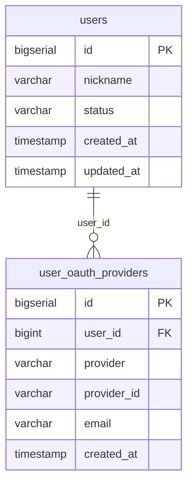

# 인증 설계

## 전략

인증은 이 서비스의 핵심 도메인이 아니다. 자체 인증 구현(비밀번호 해싱, 이메일 인증, 토큰 탈취 대응 등)은 별도 서비스 수준의 작업량을 요구하므로, Google OAuth 2.0에 위임하고 구현 비용을 최소화한다.

## 인증 플로우

```
사용자 → Google OAuth 2.0 → API 서비스 (JWT 발급)
                                   ↓
                             AI 서비스 (JWT 검증)
```

1. 사용자가 Google 소셜 로그인 요청
2. API 서비스가 OAuth 2.0 플로우를 처리하고 사용자 정보 수신
3. `provider_id`(google_id)로 `user_oauth_providers` 조회
   - 존재하면: `users.id` 반환 → JWT 발급
   - 없으면: `users` INSERT → `user_oauth_providers` INSERT → JWT 발급
4. 이후 요청은 JWT로 인증. AI 서비스도 동일한 JWT를 검증
5. JWT payload에 내부 `users.id`를 담아 사용. `google_id`는 최초 연동 시에만 사용

## JWT 설계

| 토큰 | 만료 | 저장 위치 | 비고 |
|---|---|---|---|
| Access Token | 15~30분 | 클라이언트 | 서버 상태 저장 없음 |
| Refresh Token | 7일 | Redis | 서버 측 강제 만료 가능 |

Refresh Token을 Redis에 저장하여 JWT의 구조적 단점인 서버 측 무효화 불가 문제를 보완한다. 토큰 탈취 시 Redis에서 Refresh Token을 삭제하여 즉시 세션을 종료할 수 있다.

## 테이블 구성

| 테이블 | DB | 역할 |
|---|---|---|
| `users` | `on_data` | 서비스 내부 사용자. 식별자, 닉네임, 상태 |
| `user_oauth_providers` | `on_data` | OAuth 연동 정보. 제공자별 외부 ID, 이메일 |

### ERD



### users / user_oauth_providers 분리 근거

OAuth 제공자(GitHub, Kakao 등)를 추가할 때 `users` 구조를 변경하지 않고 `user_oauth_providers`에 row만 추가하면 된다. `users`는 서비스 내부 속성만 관리하고, 외부 IdP 종속 정보는 `user_oauth_providers`가 담당한다.