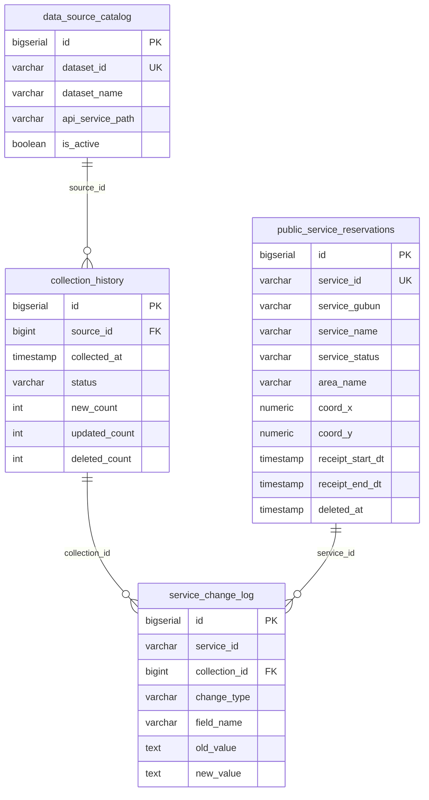

```mermaid
erDiagram
    data_source_catalog {
        bigserial   id          PK
        varchar     dataset_id  UK
        varchar     dataset_name
        varchar     api_service_path
        boolean     is_active
    }

    collection_history {
        bigserial   id          PK
        bigint      source_id   FK
        timestamp   collected_at
        varchar     status
        int         new_count
        int         updated_count
        int         deleted_count
    }

    service_change_log {
        bigserial   id              PK
        varchar     service_id
        bigint      collection_id   FK
        varchar     change_type
        varchar     field_name
        text        old_value
        text        new_value
    }

    public_service_reservations {
        bigserial   id              PK
        varchar     service_id      UK
        varchar     service_gubun
        varchar     service_name
        varchar     service_status
        varchar     area_name
        numeric     coord_x
        numeric     coord_y
        timestamp   receipt_start_dt
        timestamp   receipt_end_dt
        timestamp   deleted_at
    }

    data_source_catalog         ||--o{ collection_history         : "source_id"
    collection_history          ||--o{ service_change_log         : "collection_id"
    public_service_reservations ||--o{ service_change_log         : "service_id"
```