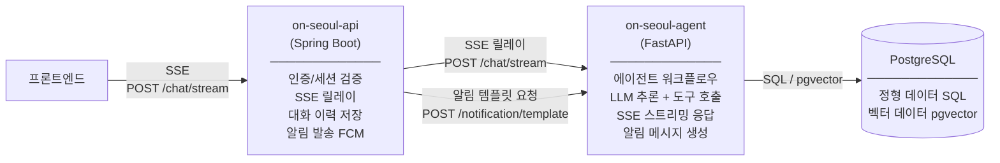
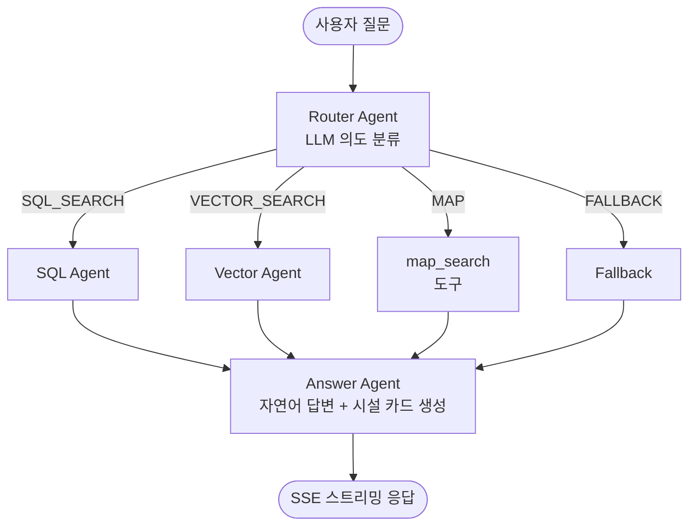

# on-seoul-agent

서울시 공공서비스 예약 정보에 대한 자연어 질의를 처리하는 AI 서비스입니다. FastAPI + LangChain 기반의 멀티에이전트 오케스트레이션으로 사용자 의도를 분류하고, 적절한 도구를 호출하여 답변을 생성합니다. (MVP는 LangChain 으로 구축하며, 안정화 이후 LangGraph 로 전환합니다.)

---

## 서비스 책임

이 서비스는 **LLM 기반 추론과 데이터 조회**를 담당합니다. 인증, 세션, 데이터 수집, 알림 발송은 `on-seoul-api`(Spring Boot)의 책임입니다.

| 책임 | 설명 |
|---|---|
| 의도 분류 | 사용자 질문을 SQL 조회 / 벡터 검색 / 지도 탐색 / 일반 안내로 분류 |
| 정형 데이터 조회 | PostgreSQL에서 카테고리, 접수 상태, 지역, 날짜 기반 SQL 조회 |
| 의미 검색 | pgvector 임베딩 유사도 기반 시설 검색 |
| 지도 데이터 반환 | earthdistance + cube로 반경 내 시설을 GeoJSON 형식으로 반환 |
| 자연어 답변 생성 | 조회 결과를 시설 카드(이름, 상태, 기간, 예약 링크)로 가공하여 응답 |
| 알림 템플릿 생성 | 예약 서비스의 내용 및 상태 변경 정보를 받아 LLM으로 알림 메시지를 생성하여 반환 (발송은 `on-seoul-api`가 처리) |

---

## 다른 서비스와의 통신



**엔드포인트**

| 엔드포인트 | 호출자 | 설명 |
|---|---|---|
| `POST /chat/stream` | `on-seoul-api` | 사용자 질문을 받아 SSE 스트리밍으로 답변 반환 |
| `POST /notification/template` | `on-seoul-api` | 상태 변경 정보를 받아 LLM으로 알림 메시지 생성 후 반환 |

- **DB 접근**: `on-seoul-agent`가 PostgreSQL에 직접 연결하여 SQL 조회 및 벡터 검색 수행
- **알림 발송**: `on-seoul-api`가 `/notification/template` 응답을 받아 FCM으로 직접 발송
- **대화 이력 저장**: `on-seoul-api`가 스트림 완료 후 질문과 최종 응답을 저장 (이 서비스는 이력을 저장하지 않음)

---

## 에이전트 워크플로우



### 에이전트 (LLM 추론)

| 에이전트 | 역할 |
|---|---|
| Router Agent | 사용자 질문의 의도를 분류하고 다음 에이전트/도구를 결정 |
| SQL Agent | sql_search 도구를 호출하여 정형 데이터 조회 |
| Vector Agent | 질의를 정제한 뒤 vector_search 도구를 호출하여 유사도 검색 |
| Answer Agent | 조회 결과를 자연어 답변과 시설 카드로 가공. URL 미존재 시 fallback 링크 처리 |

### 도구 (룰베이스, LLM 추론 없음)

| 도구 | 설명 |
|---|---|
| sql_search | PostgreSQL 정형 조회 (카테고리, 상태, 지역, 날짜 필터) |
| vector_search | pgvector 임베딩 유사도 검색 |
| map_search | earthdistance + cube 반경 검색, GeoJSON 반환 |

---

## 디렉토리 구조

```
on-seoul-agent/
├── main.py                  # FastAPI 앱 진입점
├── pyproject.toml           # 의존성 관리 (uv)
├── routers/
│   └── chat.py              # POST /chat/stream — SSE 스트리밍 엔드포인트
├── agents/
│   ├── workflow.py          # LangChain(LCEL) 워크플로우 조립 — 이후 LangGraph(graph.py)로 전환 예정
│   ├── router_agent.py      # 의도 분류
│   ├── sql_agent.py         # SQL 조회 에이전트
│   ├── vector_agent.py      # 벡터 검색 에이전트
│   └── answer_agent.py      # 답변 생성 에이전트
├── tools/
│   ├── sql_search.py        # PostgreSQL 정형 조회
│   ├── vector_search.py     # pgvector 유사도 검색
│   └── map_search.py        # 반경 검색 + GeoJSON 반환
├── llm/
│   ├── client.py            # LLM API 호출 추상화 (Gemini / GPT)
│   └── embedder.py          # 텍스트 → 벡터 변환
├── schemas/
│   ├── state.py             # AgentState (LangChain 워크플로우 공유 상태, LangGraph 전환 대비 규약 유지)
│   ├── events.py            # SSE 이벤트 타입
│   └── chat.py              # ChatRequest / ChatResponse
├── core/
│   ├── config.py            # pydantic-settings 환경변수 관리
│   └── database.py          # async SQLAlchemy 세션
├── scripts/
│   └── embed_metadata.py    # 시설 메타데이터 임베딩 배치 적재
└── middleware/
    └── metrics.py           # 응답시간 측정
```

---

## 기술 스택

| 영역 | 기술 |
|---|---|
| 프레임워크 | FastAPI |
| 에이전트 오케스트레이션 | LangChain (MVP) → LangGraph (Post-MVP 전환 예정) |
| LLM | Gemini 2.0 Flash (기본) / GPT-4o-mini (폴백) |
| DB | PostgreSQL + pgvector (async SQLAlchemy) |
| 캐시 | Redis |
| 패키지 관리 | uv |
| 테스트 | pytest + pytest-asyncio |
| 린터/포맷터 | ruff |
| Python | 3.13+ |

---

## 실행 방법

```bash
# 의존성 설치
uv sync

# 개발 서버 실행
uv run uvicorn main:app --reload

# 헬스체크
curl http://localhost:8000/health

# 테스트
uv run pytest

# 린트 & 포맷
uv run ruff check .
uv run ruff format .
```
