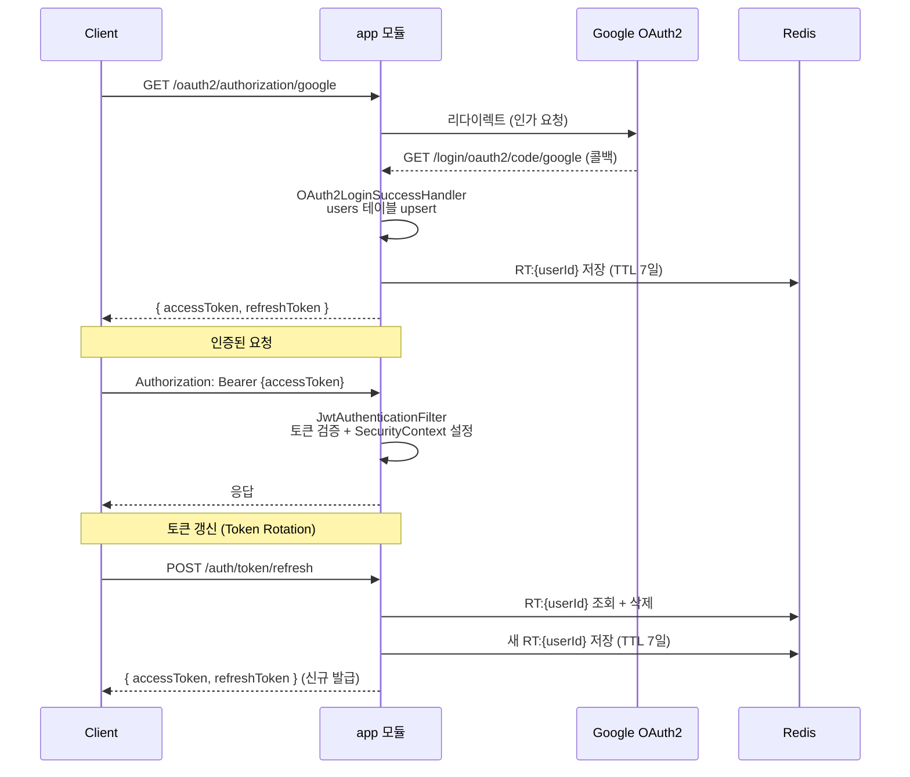

# app 모듈

Spring Boot 진입점 모듈입니다. 인증(OAuth2 + JWT), 수집 스케줄러 트리거, 전역 예외 처리를 담당합니다.

**책임 범위**: HTTP 요청 수신 → 인증/인가 → 서비스 위임 → 응답 반환

수집 파이프라인 구현은 `collector` 모듈이 담당하며, `app` 모듈의 `CollectionScheduler`는 트리거 역할만 합니다.

---

## 인증 흐름



---

## 모듈 구조

```
app/
├── OnSeoulApiApplication.java          # Spring Boot 진입점
├── auth/
│   ├── AuthController.java             # POST /auth/token/refresh, POST /auth/logout
│   ├── AuthService.java                # Refresh Token 검증 + Token Rotation + 로그아웃
│   └── dto/
│       ├── TokenResponse.java          # { accessToken, refreshToken }
│       └── RefreshRequest.java         # { refreshToken } — @NotBlank 검증
├── controller/
│   └── CollectionController.java       # POST /admin/collection/trigger
├── exception/
│   └── GlobalExceptionHandler.java     # @RestControllerAdvice — 전역 예외 → JSON 응답
├── scheduler/
│   └── CollectionScheduler.java        # @Scheduled 매일 08시 수집 트리거
└── security/
    ├── SecurityConfig.java             # 보안 필터 체인 구성
    ├── OAuth2LoginSuccessHandler.java  # 소셜 로그인 성공 처리 — upsert + JWT 발급
    └── jwt/
        ├── JwtProvider.java            # HS256 토큰 생성 · 검증
        └── JwtAuthenticationFilter.java# Bearer 토큰 파싱 + SecurityContext 설정
```

---

## 주요 컴포넌트

### JwtProvider

HS256 알고리즘으로 Access Token / Refresh Token을 생성하고 검증합니다.

| 토큰 | 만료 | 목적 |
|---|---|---|
| Access Token | 15분 (`jwt.access-token-minutes`) | API 인증 |
| Refresh Token | 7일 (`jwt.refresh-token-minutes`, 기본 10080분) | Access Token 재발급 |

- **알고리즘 고정**: `verifyWith(signingKey)`로 서버 키와 알고리즘을 고정하여 알고리즘 혼용 공격을 차단합니다.
- **만료/변조 분리**: `ExpiredJwtException` → `EXPIRED_TOKEN`, `SignatureException` → `INVALID_TOKEN`으로 구분하여 클라이언트가 원인을 알 수 있도록 합니다.
- `extractUserIdSafely(token)`: 예외 없이 `Optional<Long>`을 반환합니다. 필터에서 1회 파싱으로 검증과 userId 추출을 동시에 처리할 때 사용합니다.

### OAuth2LoginSuccessHandler

OAuth2 콜백에서 사용자 upsert와 JWT 발급을 처리합니다.

```
인증 성공
  └─ (provider, provider_id) 기준 users 테이블 upsert
      ├─ 신규: INSERT
      └─ 기존: email / nickname 갱신
  └─ ACTIVE 여부 확인 — SUSPENDED / DELETED → 403 반환
  └─ AccessToken + RefreshToken 발급
  └─ Redis: RT:{userId} = refreshToken (TTL 7일)
  └─ JSON 응답: { accessToken, refreshToken }
```

> **보안 참고**: Refresh Token을 JSON body로 반환하면 SPA가 `localStorage`에 저장하게 되어 XSS 취약점이 있습니다. 향후 `HttpOnly; Secure; SameSite=Strict` 쿠키로 이동을 권장합니다.

### AuthService — Token Rotation

`POST /auth/token/refresh` 호출 시 기존 Refresh Token을 즉시 폐기하고 새 토큰 쌍을 발급합니다.

```
1. refreshToken JWT 검증 + userId 추출
2. Redis RT:{userId} 존재 + 일치 확인
3. 기존 Refresh Token 삭제 (Redis)
4. 사용자 status 확인 — ACTIVE가 아니면 FORBIDDEN
5. 새 AccessToken + RefreshToken 발급
6. 새 RT:{userId} 저장 (TTL 7일)
```

탈취된 Refresh Token은 1회 사용 후 즉시 무효화됩니다.

### SecurityConfig

| 경로 | 접근 규칙 |
|---|---|
| `/actuator/health` | 인증 불필요 |
| `/auth/**` | 인증 불필요 (`/auth/logout` 포함) |
| 그 외 모두 (`/admin/**` 포함) | 인증 필요 |

- 세션 사용 안 함 (`STATELESS`)
- `JwtAuthenticationFilter`를 `UsernamePasswordAuthenticationFilter` 앞에 등록
- 401 / 403 응답은 `{"code": "UNAUTHORIZED", "message": "..."}` JSON 형태로 반환

---

## 예외 처리

`GlobalExceptionHandler`가 `OnSeoulApiException`을 JSON으로 변환합니다.

```json
{ "code": "EXPIRED_TOKEN", "message": "만료된 토큰입니다." }
```

| ErrorCode | HTTP | 발생 상황 |
|---|---|---|
| `UNAUTHORIZED` | 401 | 인증 정보 없음 |
| `FORBIDDEN` | 403 | 권한 없음, 비활성 계정 |
| `EXPIRED_TOKEN` | 401 | JWT 만료 |
| `INVALID_TOKEN` | 401 | JWT 변조 / 잘못된 형식 |
| `INVALID_REFRESH_TOKEN` | 401 | Redis에 없는 Refresh Token |

---

## 설정

`application.yml`에 아래 항목을 추가합니다.

```yaml
spring:
  security:
    oauth2:
      client:
        registration:
          google:
            client-id: ${GOOGLE_CLIENT_ID}
            client-secret: ${GOOGLE_CLIENT_SECRET}
            scope: openid,email,profile

jwt:
  secret: ${JWT_SECRET}                  # Base64 인코딩된 HS256 키 (256비트 이상)
  access-token-minutes: 15               # Access Token 만료 (기본값 15분)
  refresh-token-minutes: 10080           # Refresh Token 만료 (기본값 7일)
```

**JWT_SECRET 생성 예시**:
```bash
openssl rand -base64 32
```

Redis 설정은 루트 `application.yml`의 `spring.data.redis.*` 항목을 사용합니다.

---

## 테스트

```bash
# app 모듈 테스트만 실행
./gradlew :app:test

# 전체 테스트
./gradlew test
```

테스트 커버리지:

| 대상 | 검증 항목 |
|---|---|
| `JwtProvider` | 토큰 생성 · 검증 성공, 만료 토큰, 변조 토큰, Refresh Token 구분 |
| `JwtAuthenticationFilter` | 유효 토큰 → SecurityContext 설정, 헤더 없음 스킵, 만료/변조 → 401 |
| `AuthService` | Token Rotation, Redis 없는 경우 401, 비활성 계정 403, 로그아웃 후 재사용 차단 |
| `AuthController` | 갱신 성공, 유효하지 않은 토큰 401, 입력 검증 실패 400 |
| `SecurityConfig` | `/actuator/health` 미인증 200, 미인증 보호 경로 401, `/admin/**` 미인증 401 |
