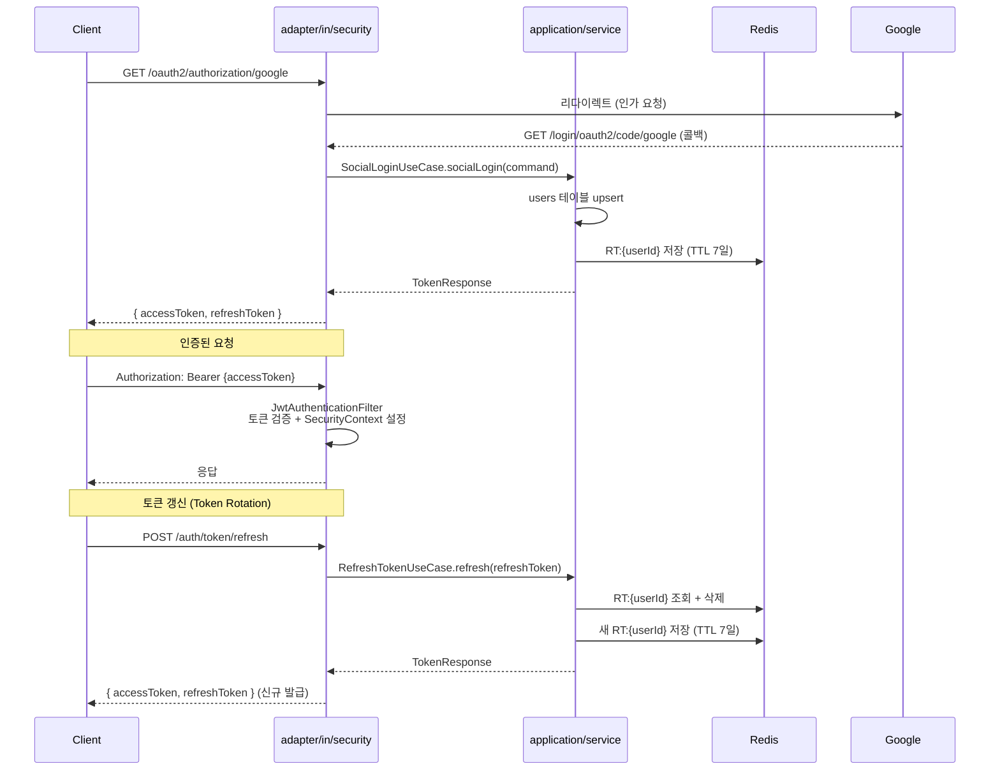

# bootstrap 모듈

Web API 전용 Spring Boot 부트스트랩 모듈입니다. `OnSeoulApiApplication.java`와 `application.yml`만 포함하며, 실제 비즈니스 로직은 `application` 모듈과 `adapter` 모듈에 위치합니다.

> 수집 배치(`@Scheduled`)는 `collector` 모듈이 담당합니다. 두 부트는 동일한 헥사고날 코어(`domain/application/adapter`)를 공유합니다.

**의존**: `adapter` → `application` → `domain` (헥사고날 아키텍처)

---

## 인증 흐름



---

## 주요 컴포넌트 위치

### adapter/in/security/

| 클래스 | 역할 |
|---|---|
| `SecurityConfig` | 보안 필터 체인 구성 |
| `OAuth2LoginSuccessHandler` | 소셜 로그인 콜백 수신 → `SocialLoginUseCase` 호출 → JSON 응답 |
| `JjwtTokenIssuer` | `TokenIssuerPort` 구현체. HS256 토큰 생성 · 검증 (jjwt) |
| `JwtAuthenticationFilter` | Bearer 토큰 파싱 + SecurityContext 설정 |

### adapter/in/web/

| 클래스 | 역할 |
|---|---|
| `AuthController` | `POST /auth/token/refresh`, `POST /auth/logout` |
| `CollectionController` | `POST /admin/collection/trigger` (수동 수집 트리거) |
| `ChatController` | `POST /query` — AI 서비스 SSE 릴레이 |
| `GlobalExceptionHandler` | `@RestControllerAdvice` — OnSeoulApiException → JSON |

### adapter/out/

| 패키지 | 구현 포트 |
|---|---|
| `persistence/user/` | `LoadUserPort`, `SaveUserPort` |
| `persistence/chat/` | `SaveChatRoomPort`, `LoadChatRoomPort`, `SaveChatMessagePort` |
| `persistence/reservation/` | `LoadPublicServicePort`, `SavePublicServicePort` |
| `persistence/collection/` | `SaveCollectionHistoryPort`, `SaveServiceChangeLogPort` |
| `redis/` | `RefreshTokenStorePort` |
| `seoulapi/` | `SeoulDatasetFetchPort` |
| `kakao/` | `GeocodingPort` |
| `aiservice/` | AI 서비스 `/chat/stream` WebClient 호출 |

### application/service/

| 클래스 | 구현 유스케이스 |
|---|---|
| `SocialLoginService` | `SocialLoginUseCase` — users upsert + 토큰 발급 + RT 저장 |
| `RefreshTokenService` | `RefreshTokenUseCase` — RT 검증 + Token Rotation |
| `LogoutService` | `LogoutUseCase` — RT 삭제 |
| `CollectDatasetService` | `CollectDatasetUseCase` — 서울 Open API 수집 + upsert |
| `SendQueryService` | `SendQueryUseCase` — ChatRoom/ChatMessage 이력 저장 |

---

## 토큰 정책

| 토큰 | 만료 | 저장 위치 |
|---|---|---|
| Access Token | 15분 (`jwt.access-token-minutes`) | 클라이언트 메모리 |
| Refresh Token | 7일 (`jwt.refresh-token-minutes` 기본 10080분) | Redis `RT:{userId}` |

**Token Rotation**: `POST /auth/token/refresh` 호출 시 기존 RT를 즉시 삭제하고 새 토큰 쌍을 발급합니다. 탈취된 RT는 1회 사용 후 무효화됩니다.

---

## SecurityConfig 접근 규칙

| 경로 | 규칙 |
|---|---|
| `/actuator/health` | 인증 불필요 |
| `/auth/**` | 인증 불필요 |
| `/oauth2/authorization/**`, `/login/oauth2/code/**` | 인증 불필요 |
| 그 외 모두 (`/admin/**` 포함) | 인증 필요 |

- 세션: `IF_REQUIRED` (OAuth2 Code Flow의 state 검증 위해 필요, API 인증은 JWT 전용)
- 401 / 403: `{"code": "UNAUTHORIZED", "message": "..."}` JSON 반환

---

## 예외 코드

| ErrorCode | HTTP | 발생 상황 |
|---|---|---|
| `UNAUTHORIZED` | 401 | 인증 정보 없음 |
| `FORBIDDEN` | 403 | 권한 없음, 비활성 계정 (SUSPENDED/DELETED) |
| `EXPIRED_TOKEN` | 401 | JWT 만료 |
| `INVALID_TOKEN` | 401 | JWT 변조 / 잘못된 형식 |
| `INVALID_REFRESH_TOKEN` | 401 | Redis에 없는 Refresh Token |
| `AI_SERVICE_ERROR` | 502 | AI 서비스 호출 오류 |
| `CHAT_ROOM_NOT_FOUND` | 404 | 존재하지 않는 대화방 |

---

## 설정

```yaml
# application.yml 필수 항목
spring:
  security:
    oauth2:
      client:
        registration:
          google:
            client-id: ${GOOGLE_CLIENT_ID}
            client-secret: ${GOOGLE_CLIENT_SECRET}
            scope: openid,email,profile
          kakao:
            client-id: ${KAKAO_CLIENT_ID}
            client-secret: ${KAKAO_CLIENT_SECRET}

jwt:
  secret: ${JWT_SECRET}          # Base64 인코딩된 HS256 키 (256비트 이상)
  access-token-minutes: 15
  refresh-token-minutes: 10080

ai:
  service:
    url: ${AI_SERVICE_URL:http://localhost:8000}
    stream-timeout-seconds: 120
```

**JWT_SECRET 생성:**
```bash
openssl rand -base64 32
```

---

## 실행 및 테스트

```bash
# 전체 빌드
./gradlew build

# Web API 서버 실행
./gradlew :bootstrap:bootRun

# 수집 배치 실행 (별도 프로세스)
./gradlew :collector:bootRun

# 전체 테스트 (ArchUnit 포함)
./gradlew test

# 헬스체크
curl http://localhost:8080/actuator/health
```
