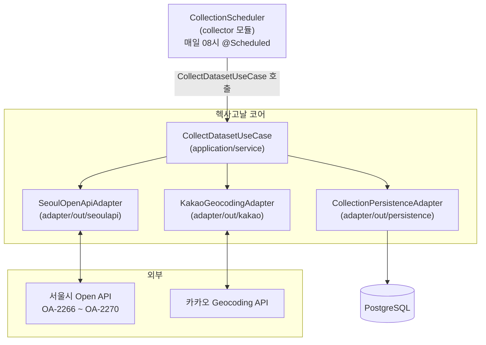

# collector 모듈

수집 배치 전용 Spring Boot 부트스트랩 모듈입니다. `@Scheduled` 매일 08시에 서울 열린데이터 광장 5개 API를 순차 수집합니다.

Web/Security 의존 없이 순수 배치 프로세스로 동작하며, `bootstrap`(Web API)과 동일한 헥사고날 코어(`domain/application/adapter`)를 공유합니다.

**의존**: `adapter` → `application` → `domain` (헥사고날 코어 공유)

---

## 수집 흐름



---

## 모듈 구조

```
collector/
├── CollectorApplication.java   # @SpringBootApplication + @EnableScheduling
├── CollectionScheduler.java    # @Scheduled(cron="0 0 8 * * *") → CollectDatasetUseCase 호출
└── src/main/resources/
    └── application.yml         # DB / Seoul API / Kakao 설정 (Web/Security 없음)
```

실제 수집 파이프라인 로직은 헥사고날 코어에 있습니다:

| 역할 | 위치 |
|---|---|
| 수집 오케스트레이션 | `application/service/CollectDatasetService.java` |
| Seoul Open API 호출 | `adapter/out/seoulapi/SeoulOpenApiAdapter.java` |
| DTO → 엔티티 변환 | `adapter/out/seoulapi/PublicServiceRowMapper.java` |
| Geocoding fallback | `adapter/out/kakao/KakaoGeocodingAdapter.java` |
| DB Upsert / 이력 기록 | `adapter/out/persistence/collection/` |

---

## 수집 대상 API

| 카테고리 | 서비스명 | 데이터셋 ID |
|---|---|---|
| 체육시설 | `ListPublicReservationSports` | OA-2266 |
| 시설대관 | `ListPublicReservationInstitution` | OA-2267 |
| 교육 | `ListPublicReservationEducation` | OA-2268 |
| 문화행사 | `ListPublicReservationCulture` | OA-2269 |
| 진료 | `ListPublicReservationMedical` | OA-2270 |

수집 흐름:
```
수집이력 생성 → Open API 호출 (200건씩 페이지네이션) → DTO 변환
→ 기존 데이터 비교 → 신규/변경/유지 분류 (service_id 기준)
→ DB Upsert → Geocoding fallback → 수집이력 결과 기록
```

## 부분 실패 처리

5개 API를 순차 호출할 때 일부가 실패해도 나머지 수집은 계속 진행합니다.
각 API마다 독립적인 `collection_history` 레코드를 생성합니다.

---

## 설정

```yaml
# collector/src/main/resources/application.yml 필수 항목
spring:
  datasource:
    url: ${DB_URL}
    username: ${DB_USERNAME}
    password: ${DB_PASSWORD}

seoul:
  api:
    key: ${SEOUL_OPENAPI_KEY}
    base-url: http://openapi.seoul.go.kr:8088
    page-size: 200
    max-retries: 3

kakao:
  api:
    key: ${KAKAO_REST_API_KEY}
```

---

## 실행

```bash
# 수집 배치 단독 실행 (개발)
./gradlew :collector:bootRun

# 배치 jar 빌드
./gradlew :collector:bootJar
java -jar collector/build/libs/collector.jar

# 수집 수동 트리거 (bootstrap Web API가 실행 중일 때)
curl -X POST http://localhost:8080/admin/collection/trigger
```

> `POST /admin/collection/trigger` 수동 트리거 엔드포인트는 `bootstrap` Web API가 담당합니다.
