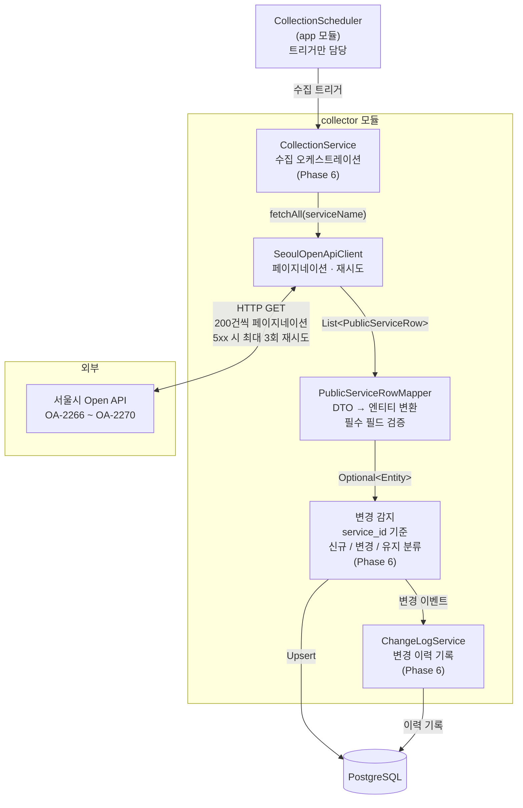

# collector 모듈

서울 열린데이터 광장 Open API에서 공공서비스 예약 데이터를 수집하고 DB에 적재하는 파이프라인 모듈입니다.

**책임 범위**: API 호출 → 페이지네이션 → DTO 변환 → 변경 감지(신규/변경/유지) → DB Upsert → 수집 이력 기록

`app` 모듈의 `CollectionScheduler`가 트리거만 담당하고, 수집 파이프라인 전체는 `collector` 모듈이 책임집니다.

---

## 수집 흐름



---

## 모듈 구조

```
collector/
├── config/
│   ├── CollectorConfig.java        # WebClient Bean 등록
│   └── SeoulApiProperties.java     # seoul.api.* 설정 바인딩
├── domain/                         # 수집 파이프라인 전용 엔티티
│   ├── CollectionHistory.java      # 수집 실행 이력
│   ├── ServiceChangeLog.java       # 서비스 단위 변경 이력
│   └── ApiSourceCatalog.java      # 수집 대상 API 카탈로그
├── repository/
│   ├── CollectionHistoryRepository.java
│   ├── ServiceChangeLogRepository.java
│   └── ApiSourceCatalogRepository.java
├── enums/
│   ├── CollectionStatus.java       # SUCCESS / FAILED / PARTIAL
│   └── ChangeType.java             # NEW / UPDATED / DELETED
├── dto/
│   ├── PublicServiceRow.java       # API 응답 row (24개 필드)
│   └── SeoulApiResponse.java       # API 응답 최상위 래퍼
├── exception/
│   ├── SeoulApiException.java      # Open API 호출 오류 기반 클래스 (4xx)
│   └── SeoulApiServerException.java# 5xx 오류 — 재시도 대상
├── service/                        # (Phase 6)
│   ├── CollectionService.java      # 수집 파이프라인 오케스트레이션
│   └── ChangeLogService.java       # 서비스 변경 이력 기록
├── PublicServiceRowMapper.java     # DTO → 엔티티 변환기 (필수 필드 검증 포함)
└── SeoulOpenApiClient.java         # Open API 호출 클라이언트
```

> 공용 엔티티 `PublicServiceReservation` 및 해당 Repository는 `domain` 모듈에 있습니다.
> `collector/domain`에는 수집 파이프라인 운영 데이터(이력·변경 로그·카탈로그)만 둡니다.

---

## 주요 컴포넌트

### SeoulOpenApiClient

서울시 Open API의 5개 서비스를 페이지네이션으로 전체 수집합니다.

- **페이지 크기**: 200건 (`seoul.api.page-size`, 기본값 200)
- **재시도**: 5xx 응답 시 지수 백오프로 최대 3회 재시도 (`SeoulApiServerException` 필터)
- **4xx 오류**: 재시도 없이 즉시 `SeoulApiException` 발생

```java
// app 모듈에서의 호출 예시
List<PublicServiceRow> rows = client.fetchAll("ListPublicReservationCulture");
```

**페이지네이션 종료 조건**: 첫 번째 페이지 응답의 `list_total_count`를 읽어 전체 호출 횟수를 결정합니다. 빈 응답이 올 때까지 반복하는 방식이 아니므로 불필요한 추가 호출이 발생하지 않습니다.

```
총 건수=450, 페이지 크기=200 → 1-200, 201-400, 401-450 (3회 호출)
```

**RESULT.CODE 처리 정책**: 서울시 API는 HTTP 200을 반환하면서도 응답 body에 오류 코드를 담는 경우가 있습니다.

| RESULT.CODE | 의미 | 처리 |
|---|---|---|
| `INFO-000` | 정상 처리 | 데이터 반환 |
| `INFO-200` | 해당하는 데이터 없음 | 빈 목록 반환 (예외 없음) |
| `ERROR-*` 등 | API 오류 (인증키 오류 등) | `SeoulApiException` 발생 |

`INFO-200`은 카테고리에 현재 예약 가능한 서비스가 없는 정상 상태이므로 예외로 처리하지 않습니다.

수집 대상 서비스명:

| 카테고리 | 서비스명 | 데이터셋 ID |
|---|---|---|
| 체육시설 | `ListPublicReservationSports` | OA-2266 |
| 시설대관 | `ListPublicReservationInstitution` | OA-2267 |
| 교육 | `ListPublicReservationEducation` | OA-2268 |
| 문화행사 | `ListPublicReservationCulture` | OA-2269 |
| 진료 | `ListPublicReservationMedical` | OA-2270 |

### PublicServiceRowMapper

`PublicServiceRow` DTO를 `PublicServiceReservation` JPA 엔티티로 변환합니다.

| 변환 대상 | 처리 방식 |
|---|---|
| 날짜 (`RCPTBGNDT` 등) | `yyyy-MM-dd HH:mm:ss[.S]` 파싱. null·빈 문자열·잘못된 포맷 → `null` |
| 이용 시간 (`V_MIN`, `V_MAX`) | `HH:mm` 포맷 → `LocalTime`. null·빈 문자열 → `null` |
| 좌표 (`X`, `Y`) | 문자열 → `BigDecimal`. null·빈 문자열 → `null` (Geocoding fallback 대상) |
| 취소 기준일 (`REVSTDDAY`) | 숫자 문자열 → `Short`. 파싱 실패 → `null` |
| 문자열 필드 일반 | 앞뒤 공백 제거. 공백만 있는 문자열 → `null` |

변환 실패는 예외를 던지지 않고 `null`로 처리하며, WARN 로그를 남깁니다.

---

## 수집 중 부분 실패 처리 정책

5개 API를 순차 호출할 때 일부가 실패해도 나머지 API 수집은 계속 진행합니다.
각 API 호출은 독립적인 `collection_history` 레코드를 생성하므로, 한 API의 실패가 다른 API의 수집 결과에 영향을 주지 않습니다.

```
API 1 수집 성공 → collection_history(SUCCESS)
API 2 수집 실패 → collection_history(FAILED, 에러 메시지)
API 3 수집 성공 → collection_history(SUCCESS)   ← 계속 진행
...
```

파이프라인 오케스트레이션(`CollectionService`, `CollectionScheduler`)은 Phase 6–7에서 구현합니다.

---

## 예외 계층

```
OnSeoulApiException          (common 모듈 — 전역 기반 예외)
└── SeoulApiException        (collector — Open API 오류 기반, 4xx)
    └── SeoulApiServerException  (5xx 전용, 재시도 대상)
```

`SeoulApiServerException`은 WebClient의 재시도 필터(`ex instanceof SeoulApiServerException`)로 식별하여 5xx만 선택적으로 재시도합니다. 4xx는 `SeoulApiException`으로 처리되어 재시도 없이 즉시 전파됩니다.

---

## 설정

`application.yml`에 아래 항목을 추가합니다.

```yaml
seoul:
  api:
    key: ${SEOUL_API_KEY}              # 서울 열린데이터 광장 API 키 (필수)
    base-url: http://openapi.seoul.go.kr:8088  # 기본값
    page-size: 200                     # 페이지당 수집 건수 (기본값 200)
    max-retries: 3                     # 5xx 재시도 최대 횟수 (기본값 3)
```

---

## 테스트

MockWebServer(OkHttp3)로 실제 HTTP 요청 없이 클라이언트를 검증합니다.

```bash
# collector 모듈 테스트만 실행
./gradlew :collector:test

# 전체 테스트
./gradlew test
```

테스트 커버리지:

| 대상 | 검증 항목 |
|---|---|
| `SeoulOpenApiClient` | 페이지네이션 전체 수집, 5xx 재시도 횟수, 4xx 즉시 실패, 응답 파싱 오류, INFO-200 빈 목록 반환, ERROR 코드 예외 발생 |
| `PublicServiceRowMapper` | 날짜 포맷 변형, 좌표 null, 공백 문자열, 취소 기준일 파싱 |
