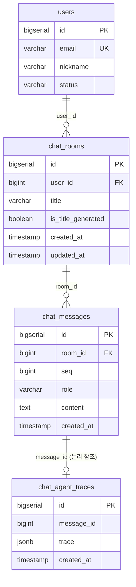

# 채팅 스키마 설계

## 테이블 구성

| 테이블 | DB | 접근 서비스 | 역할 |
|---|---|---|---|
| `chat_rooms` | `on_data` | API 서비스 | 대화 세션 단위 관리. 제목, 자동 생성 여부 포함 |
| `chat_messages` | `on_data` | API 서비스 | 메시지 단위 저장. role(USER/ASSISTANT), seq로 순서 보장 |
| `chat_agent_traces` | `on_ai` | AI 서비스 | LangGraph 실행 메타. ASSISTANT 메시지에만 생성. JSONB로 저장 |

### ERD



> `chat_agent_traces`는 `on_ai` DB에 위치하므로 `message_id`는 물리적 FK 없이 논리 참조로 관리한다.

---

## 주요 설계 전략

### 1. DB 배치

`chat_rooms`, `chat_messages`는 `on_data`에 둔다. 조회, 페이징, 제목 수정 모두 API 서비스가 처리하는 사용자 도메인 데이터이기 때문이다.

`chat_agent_traces`는 `on_ai`에 둔다. 
1. AI 서비스(`on_ai_app`)가 LangGraph 실행 완료 후 직접 INSERT할 수 있어야 하는데, `on_data`에 두면 AI 서비스에 쓰기 권한을 별도로 부여해야 하고 서비스 경계가 흐려진다. 
2. `on_ai`는 AI 서비스가 전담하는 DB이므로 trace 저장 위치로 자연스럽다.

### 2. seq 채번: PostgreSQL Sequence

메시지 순서를 `created_at`으로만 보장하면 동시 삽입 시 순서가 뒤집힐 수 있다.

전역 Sequence를 사용하여 `nextval()`로 채번한다. DB가 원자적으로 채번하므로 중복이 발생하지 않고, 동시 INSERT에서도 순서가 역전되지 않는다.

room 안에서의 순서 정렬은 `ORDER BY seq ASC`로 처리한다. seq 값이 연속이 아닐 수 있으나(1, 5, 9) 순서 보장에는 문제없다. 트랜잭션 롤백 시 채번된 값은 회수되지 않아 gap이 발생하며, 이는 Sequence의 정상 동작이다.

### 3. chat_agent_traces 분리 및 JSONB

에이전트 실행 메타(tool call 결과, node 경로, 소요 시간 등)는 대화 이력 페이징 쿼리에서 불필요하고, 디버깅/분석 시에만 조회한다. `chat_messages`에 함께 두면 row 크기가 커지고 인덱스 효율이 떨어진다.

JSONB를 사용하는 이유: LangGraph 실행 메타를 정규화하면 에이전트 구조 변경 시 마이그레이션 부담이 크다. MVP 단계에서는 JSONB로 유연하게 저장하고, 분석 필요 시 JSONB 인덱스를 추가한다.

### 4. 제목 초기화 흐름

```
사용자 첫 메시지 전송
→ chat_rooms 생성 (title = NULL)
→ 첫 응답 완료 후 LLM이 제목 요약 생성
→ API 서비스가 chat_rooms.title 업데이트
→ is_title_generated = TRUE
```

`title`이 NULL인 동안 클라이언트는 "새 대화" 같은 placeholder를 표시한다. `is_title_generated` 플래그로 제목 생성 실패 시 재시도 여부를 판단한다.

사용자가 직접 제목을 수정하면 `title`을 덮어쓰고 `is_title_generated`는 변경하지 않는다.